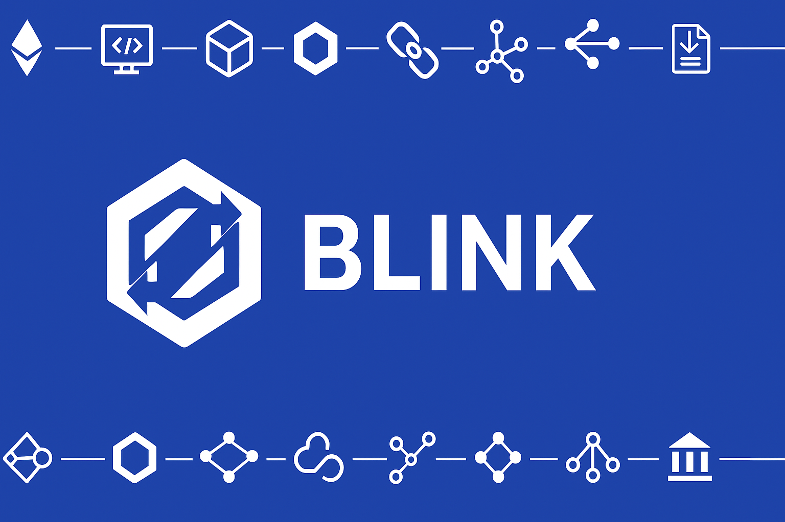

## Table of Contents

- [Transactions](https://github.com/RobItu/BLINK?tab=readme-ov-file#transactions)
- [Wallets Used](https://github.com/RobItu/BLINK?tab=readme-ov-file#wallets-used)
- [Smart Contracts (not all verified)](https://github.com/RobItu/BLINK?tab=readme-ov-file#smart-contracts-not-all-verified)
- [Qt code USDC Swaps](https://github.com/RobItu/BLINK?tab=readme-ov-file#qt-code-usdc-swaps)
- [Bank Transactions](https://github.com/RobItu/BLINK?tab=readme-ov-file#bank-transactions)
- [REAL SWAPS](https://github.com/RobItu/BLINK?tab=readme-ov-file#real-swaps)
- [Smart Send (Mock Swaps)](https://github.com/RobItu/BLINK?tab=readme-ov-file#smart-send-mock-swaps)
- [Solana](https://github.com/RobItu/BLINK?tab=readme-ov-file#solana)
- [Installation](https://github.com/RobItu/BLINK?tab=readme-ov-file#installation)
- [Prerequisites](https://github.com/RobItu/BLINK?tab=readme-ov-file#prerequisites)
- [Get Started (Frontend)](https://github.com/RobItu/BLINK?tab=readme-ov-file#get-started-frontend)
- [Get Started (Backend)](https://github.com/RobItu/BLINK?tab=readme-ov-file#get-started-backend)
- [Troubleshooting](https://github.com/RobItu/BLINK?tab=readme-ov-file#troubleshooting)
- [OpenSSL Error on Xcode 15](https://github.com/RobItu/BLINK?tab=readme-ov-file#openssl-error-on-xcode-15)


# Transactions
Transactions seen in the video listed in chronological order. 

### Wallets Used
The direction sometimes changed but for the most part: 
- Sender: 0x377Cc3297251812561157d421c6faC7C76c51d4E
- Receiver: 0x0dFBbF93b833f8e89d5cb355c3dEe9d599E3Ac78

### Smart Contracts used (all verified)
- BLINK CONTRACT ON SEPOLIA: [https://sepolia.etherscan.io/address/0x5b735434C671c4D1121Bd375437D8BFA5E8bFC5a#code](https://sepolia.etherscan.io/address/0x5b735434C671c4D1121Bd375437D8BFA5E8bFC5a#code)
- BLINK CONTRACT OF FUJI: [https://testnet.snowtrace.io/address/0x545DaAecb776F74b997b92Fc1505EAe5AC944685/contract/43113/code](https://testnet.snowtrace.io/address/0x545DaAecb776F74b997b92Fc1505EAe5AC944685/contract/43113/code)
- BLINK CONTRACT ON BASE: [https://sepolia.basescan.org/address/0xD8ddB7Ed906D38C20F488085d61E52833E979Cf0#code](https://sepolia.basescan.org/address/0xD8ddB7Ed906D38C20F488085d61E52833E979Cf0#code)

### QR code USDC Swaps
- Avax to ETH for Lemonade for $1.99 Lemonade
  - CCIP: [https://ccip.chain.link/tx/0x79f52c51c3fc332cfebd94c166a41c5cdd06d0aa071975877c5e7366df321098#/side-drawer/msg/0xd693e7c304594726f070964d0b6479745acc3a8a675c59fe66543faa0cb8a563](https://ccip.chain.link/tx/0x79f52c51c3fc332cfebd94c166a41c5cdd06d0aa071975877c5e7366df321098#/side-drawer/msg/0xd693e7c304594726f070964d0b6479745acc3a8a675c59fe66543faa0cb8a563)
- Sepolia Eth to USDC Swap for $1.99 Lemonade:
  - Explorer: [https://sepolia.etherscan.io/tx/0x17f564f87f9fc899004eeb35d0d6267ecd5256f876c7d613353adb6d4c4e5ba3](https://sepolia.etherscan.io/tx/0x17f564f87f9fc899004eeb35d0d6267ecd5256f876c7d613353adb6d4c4e5ba3)
- Base to Ethereum Sepolia for $1.99 Lemonade
  - CCIP: [https://ccip.chain.link/tx/0x78de572d42387c3265a3630da186fafa86a38598302aff51f592b929785406ab#/side-drawer/msg/0x0bc0a99252cb6f9bef3b057f32f04af582ef9c9dd5164fcc96d4b37e0bf22b84](https://ccip.chain.link/tx/0x78de572d42387c3265a3630da186fafa86a38598302aff51f592b929785406ab#/side-drawer/msg/0x0bc0a99252cb6f9bef3b057f32f04af582ef9c9dd5164fcc96d4b37e0bf22b84)

### Bank Transaction
- Sepolia to Avalanche for $2.99 USDC
  - CCIP: [https://ccip.chain.link/tx/0x065f2655f5fe705f97a551bf9f946424e656cd5d52a631798edd846fc922e554#/side-drawer/msg/0x32c5677b6be886807a3e2e8c4afb597796b80f199236764fc74cd65380d1655b](https://ccip.chain.link/tx/0x065f2655f5fe705f97a551bf9f946424e656cd5d52a631798edd846fc922e554#/side-drawer/msg/0x32c5677b6be886807a3e2e8c4afb597796b80f199236764fc74cd65380d1655b)
- Circle's Custodial Wallet receiving $2.99 USDC (viewable on terminal)
  - Explorer: [https://testnet.snowtrace.io/tx/0x22c0e9d5044d6d9d4b9c302b4bb4b678811e73c5ccad2cc988e55147163d2309](https://testnet.snowtrace.io/tx/0x22c0e9d5044d6d9d4b9c302b4bb4b678811e73c5ccad2cc988e55147163d2309)

### REAL SWAPS
Swaps made using Uniswap routers and LFJ (formerly known as Trader Joe)
- 50 USDC on Avalanche For 0.0002286 Eth Sepolia:
  - CCIP: [https://ccip.chain.link/tx/0xa5f7591d4bd7b25e18c7f98b9c8ffd8b3b3f52fc85d5c6e67f403980e1de394a#/side-drawer/msg/0x944425268f029332c16179aa7c8db0d8f792c2e2d792a6948f10c13d39d2667d](https://ccip.chain.link/tx/0xa5f7591d4bd7b25e18c7f98b9c8ffd8b3b3f52fc85d5c6e67f403980e1de394a#/side-drawer/msg/0x944425268f029332c16179aa7c8db0d8f792c2e2d792a6948f10c13d39d2667d)
  - Explorer: [https://sepolia.etherscan.io/tx/0x8cbc9224d0e05410d6c0e45561a55d479bff8540f7bb32570aa51baa34f1c4d4](https://sepolia.etherscan.io/tx/0x8cbc9224d0e05410d6c0e45561a55d479bff8540f7bb32570aa51baa34f1c4d4)
- 0.000317 USDC For 0.026371 WAVAX --> 0.000317 USDC to Sepolia
  - CCIP: [https://ccip.chain.link/tx/0x8cbc9224d0e05410d6c0e45561a55d479bff8540f7bb32570aa51baa34f1c4d4#/side-drawer/msg/0xfa1bad1df9494738f3e6db6b7e181cba3bdbb513275935cf51415b02af9093db](https://ccip.chain.link/tx/0x8cbc9224d0e05410d6c0e45561a55d479bff8540f7bb32570aa51baa34f1c4d4#/side-drawer/msg/0xfa1bad1df9494738f3e6db6b7e181cba3bdbb513275935cf51415b02af9093db)
  - Explorer: [https://testnet.snowtrace.io/tx/0x94b636a4a7661e461628e4cb5b8793ea3934c39d472ae077df1e7fdae747fa90](https://testnet.snowtrace.io/tx/0x94b636a4a7661e461628e4cb5b8793ea3934c39d472ae077df1e7fdae747fa90)
- 0.00092 USDC For 0.05211 WAVAX -> 0.00092 USDC Sepolia ETH
  - CCIP: [https://ccip.chain.link/#/side-drawer/msg/0xb424c305d4a8c4964fc9e8553b1d90d196b2bebad6c72d2ea77ba45b753267f6](https://ccip.chain.link/#/side-drawer/msg/0xb424c305d4a8c4964fc9e8553b1d90d196b2bebad6c72d2ea77ba45b753267f6)
  - Explorer: [https://testnet.snowtrace.io/tx/0x043014752ceb927650bfbdaa8ec4256a500338500dd1c81691f9ec524e941100?chainid=43113](https://testnet.snowtrace.io/tx/0x043014752ceb927650bfbdaa8ec4256a500338500dd1c81691f9ec524e941100?chainid=43113)
- 20 USDC For 0.0001653 Sepolia Eth
  -[https://sepolia.etherscan.io/tx/0xabe88c086274c413db24d701387ef7661bf4f0228b89d7d23f20ab2f854fe606](https://sepolia.etherscan.io/tx/0xabe88c086274c413db24d701387ef7661bf4f0228b89d7d23f20ab2f854fe606)

### Smart Send (Mock Swaps)
Swaps made with Chainlink Price Feeds

- $2.50 Base USDC For 0.143706 AVAX
  - CCIP: [https://ccip.chain.link/tx/0x4acd11f56aff3153b8ad98655d56cb15ada59a95da65f4306050270e142cf3b8#/side-drawer/msg/0x9bb44d34c3865e535b4253620f46813ca7389e80a02089e137543f19697b9da3](https://ccip.chain.link/tx/0x4acd11f56aff3153b8ad98655d56cb15ada59a95da65f4306050270e142cf3b8#/side-drawer/msg/0x9bb44d34c3865e535b4253620f46813ca7389e80a02089e137543f19697b9da3)
- 0.008334 Sepolia ETH For 0.00823912 Base ETH
  -CCIP: [https://ccip.chain.link/tx/0x17157c3aa24dd4c909d471cdb9813456bd84ff0ae24913b65e6b443c2573024f#/side-drawer/msg/0x393fde2218f366238ffed4bdaa6eb3fe6b638d4e1d81524166a1350471953384](https://ccip.chain.link/tx/0x17157c3aa24dd4c909d471cdb9813456bd84ff0ae24913b65e6b443c2573024f#/side-drawer/msg/0x393fde2218f366238ffed4bdaa6eb3fe6b638d4e1d81524166a1350471953384)
- 0.23000 AVAX For 0.001675 Sepolia ETH:
  -CCIP: [https://ccip.chain.link/tx/0xeaf024f6003b18d276e1d8732bd781967f9237e3547c6ab61deb473d55e3cddb#/side-drawer/msg/0x4b0d5c52b0ceef06414e4a1651bf5c36845df680c92a535dedbda01e063896aa](https://ccip.chain.link/tx/0xeaf024f6003b18d276e1d8732bd781967f9237e3547c6ab61deb473d55e3cddb#/side-drawer/msg/0x4b0d5c52b0ceef06414e4a1651bf5c36845df680c92a535dedbda01e063896aa)

### Solana
- 0.0020000000 SOL transfer to EVM
  - CCIP: [https://ccip.chain.link/#/side-drawer/msg/0xd182debb85debae3cba3119b768b2f5e2e7399af0f67bed2cd8423de4d4f45c7](https://ccip.chain.link/#/side-drawer/msg/0xd182debb85debae3cba3119b768b2f5e2e7399af0f67bed2cd8423de4d4f45c7)

# NOTE
Github shows multiple contributors, but this is because I forked the [Thirdweb wallet example repo](https://github.com/thirdweb-example/expo-starter) and never started a clean git tree. I want to emphasize that I only used Thirdwallet for sending and receiving transactions and basic scaffold of tabs layout. **All functionality, UX, UI, QR Code generator, scanner, Smart Contracts, CCIP integration, Solana integration, Smart Swap, Transaction details, webhooks and sockets, and much more was done by me and solely me.** You can see the evidence in the commits [here](https://github.com/RobItu/BLINK/commits/main/) that work started by me on June 3rd and never received assistance, it was merely a fork for their thirdwallet function!   

# Installation

Since we have the front-end and back-end there will be TWO env files and yarn installations, in addition to multiple API keys needed and Webhook connections. 

## Prerequisites
- [Thirdweb Client ID](https://thirdweb.com/dashboard/settings)
- NGROK [API Key](https://ngrok.com/docs/api/resources/api-keys/)
- NodeJS Version at least 20.18.1
- 

To run this app, you'll need either:

- [Android emulator](https://docs.expo.dev/workflow/android-studio-emulator/)
- [iOS simulator](https://docs.expo.dev/workflow/ios-simulator/)


## Get started (FrontEnd)

1. Install dependencies

On root:

```bash
yarn install
```

2. Fill .env.example with [Thirdweb Client ID](https://thirdweb.com/dashboard/settings) and NGROK [API Key](https://ngrok.com/docs/api/resources/api-keys/)
  This is extremely important for thirdweb wallet to work and for your app to communicate with the backend.

3. Start the app

```bash
npx expo start --tunnel
```

## Get Started (BackEnd)

1. Navigate to `/backend`
2. run:

```bash
yarn install
```
3. Fill in env.example. Make sure to have [Circle's SANDBOX API key](https://app-sandbox.circle.com/developer/api-key) and use the same NGROK URL you used for frontend env.  
```
PORT=3000
NODE_ENV=development
```
4. Setup webhooks for Circle's deposit, wire transfer and payout notifications (optional)
  - Navigate to [Circle's SANDBOX dashboard](https://app-sandbox.circle.com/developer/subscriptions) -> Subscriptions -> Make sure the URL Endpoint is: 
  ```
your-ngrok-url/api/webhooks/circle
  ```
**Make sure to click the ALL AWS links they send you, otherwise the webhook will never be setup and be forever stuck in pending!!!**

5. Setup Alchemy Webhook for USDC payments notifications (optional)
  - Navigate to https://dashboard.alchemy.com/webhooks/create
  - Make your URL endpoint:
  ```
your-ngrok-URL/webhook/usdc-transfer
  ```

and add address of wallet you want to monitor. 

6. Run these two on seperate terminals

``` 
ngrok http 3000 (connects your app to backend) 
```
``` 
npm run dev (starts server)
 ```

These two terminals must be running at all times along with ```npx expo start --tunnel``` on a seperate terminal for full functionality. 

## Troubleshooting
- I have added multiple logs, so keep your eye out on your terminal. 
- Keep your eye out for your ngrok http URL it always changes when you restart it. 

| Problem                       | Solution                                                                                                    |
|-------------------------------|-------------------------------------------------------------------------------------------------------------|
| App randomly reloads         | Currently none. I believe this is because there's too much load on the app while being hosted locally. Offloading to other services can help. |
| Websocket keeps disconnecting | Adding pings and interacting with the app helps keep it connected longer, but it will always disconnect after some time. |


From Thirdwallet's repo (I never encountered this issue but just in case):


### OpenSSL Error on Xcode 16

If using xcode 16, you may encounter a OpenSSL error when trying to build the app. This is because xcode 16 requires a newer version of OpenSSL than the one specified in the current app.json.

To fix this, change the version of OpenSSL specified in the `app.json` file to `3.3.2000`.

- Open the `app.json` file
- Find the `ios` > `extraPods` section
- Set `"version": "3.3.2000"` for the `OpenSSL-Universal` pod
- Save the file

Then run `npx expo prebuild` to update the native modules with the new OpenSSL version and run the app again.

###

